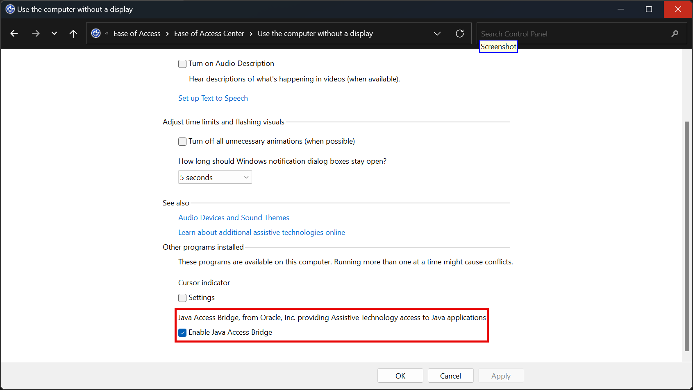

# DragonBot

DragonBot is an extension of Dragon NaturallySpeaking designed to fully automate a Microsoft Windows computer via voice, specifically tailored to the disabled or injured although anyone can use it. To watch a demo of DragonBot's capabilities, follow the link [here](https://youtu.be/5kk97WS6b6c?si=N3YXUeKJOaGJLWnn).

## A Word About Sponsorship

There is a private version of DragonBot available only to sponsors. This repository will prioritize bug fixes, feature requests, and updates faster than the public version of the repository. The public version of the repository will always intentionally be kept out of date.

There should also be no expectations for support unless you become a sponsor.

## Prerequisites

See [Java Processes](#java_processes) for Java application automation prerequisites.

## Installation

Unzip `Installer.zip` from the latest release and execute the `Installer.exe` file ***with administrator privileges*** and reboot the computer if prompted. That's it! You are ready to begin using DragonBot!

## Compatibility

Tested on Microsoft Windows 11 with Dragon Professional 16 and built on version 4.8 of the .NET Framework although it should work perfectly fine on Windows 10 and most 64-bit versions of Windows. The application is 64-bit.

## Known Issues

Some freezing has been experienced with commands that show numbered squares in various applications as not all applications cooperate with Microsoft's UI Automation or MSAA framework which is how this process is done. It is a limitation that cannot be avoided, but it is not very common.

## Visual Studio Fix

You will notice that some child windows inside of Visual Studio cause Dragon to freeze. This is not an issue with `DragonBot`, rather Dragon itself as apparently it has an issue with the application. To fix it, run `C:\Program Files (x86)\Nuance\NaturallySpeaking\Program\ToggleFullTextControlWPF.exe` and make sure it says it is set to disabled. Visual Studio is not the only program known to have this problem, so it may fix issues with other applications too!

### Screenshot Command & ShareX

The `Screenshot` command is meant to work with `ShareX` via its executable and command line arguments to make screenshotting available from any application. Some virtualization softwares make it difficult to release input from a virtual machine and then press the `Print Screen` key to perform a screenshot. This is a solution to that. If you don't have it installed and you are noticing the command is not working, this is why. The executable must be within your PATH.

### A Word About Antivirus

Some users have experienced their antivirus complaining about the installer program. I'm not signing the binary with a code signing certificate from Microsoft and the program does things like modify registry keys and interact with the certificate store. Some vendors might consider this pattern malicious and trigger an alert. If you get a warning from your antivirus software, allow the program as an exclusion to suppress warnings.

## MSAA Processes

This program will default to using UI Automation in order to provide numbered icons inside of applications. MSAA support is included as a fallback. If you think that an application would respond better to MSAA, you can edit the global list of MSAA processes by clicking `Menu -> MSAA Processes -> Edit MSAA Processes`. To add a new process, click `Menu -> MSAA Processes -> Add MSAA Process` and enter the process name of the application. To save these changes and make them persistent when you close the program, click `Menu -> MSAA Processes -> Save MSAA Processes`. Any time that you execute a voice command to display numbers in that application in the future, it will use MSAA now instead.

## Java Processes

In order to provide accessibility to Java applications on Windows, you need to have the Java Runtime Environment (JRE) or Java Development Kit (JDK) installed. The version needs to be above Java 7 Update 6. Once either is installed, you then need to enable the Java Access Bridge. You can do this in two ways, either the command line or from the Control Panel. To enable via the command line, start a command prompt ***with administrator privileges*** and run the following command:

```bat
C\> "C:\Program Files\Java\jdk-11\bin\jabswitch" -enable 
```

*Note that `jdk-11` is a placeholder and may be different on your system depending on if you have the JRE or JDK installed, and the version may be different.*

To enable via the Control Panel, follow the steps below:

1. Go to the Control Panel.
2. Navigate to 'Ease of Access' and then to 'Ease of Access Center'.
3. Select the option 'Use the computer without a display'.
4. Within the section 'Other programs installed', you should find and select the checkbox to 'Enable Java Access Bridge'.



Once you have enabled the Java Access Bridge, the next step will be to add Java processes to DragonBot so it knows when to use the Java Access Bridge to provide numbered icon commands. To add a new process, click `Menu -> Java Processes -> Add Java Process` and enter the process name of the application. To save these changes and make them persistent when you close the program, click `Menu -> Java Processes -> Save Java Processes`. Any time that you execute a voice command to display numbers in that application in the future, it will use the Java Access Bridge now instead.

### Delay On Program Exit

There is a delay for a few minutes if you attempt to close the program. This is some undocumented bug with Dragon and its `COM` implementations. Due to the fact I do not control the source code of Dragon, there is unfortunately nothing that can be done except me tell you about the issue. So if you see that the program is taking a long time to close and exit, that is why. Please do not forcefully terminate the program while it is shutting down to avoid the delay if you would like to start it again within the same Dragon session, as this delay is the unregister process of all the commands.

### Error Log

The program comes with an error log that will store errors it encounters as it runs. If you cannot access the error log from the GUI, is located at `C:\Users\<your_username>\AppData\Local\DragonBot\error.log`. You can open this file and view it in any text editor. If you are experiencing issues with the program, it is encouraged to include output from this log.

## Issues and Support

If you encounter an issue outside of the known issues list, feel free to open an issue on this repository and I will try my best to come to a resolution for you. **PLEASE READ THIS ENTIRE DOCUMENT BEFORE OPENING AN ISSUE.** There is a chance the solution to your issue is already on this page.
